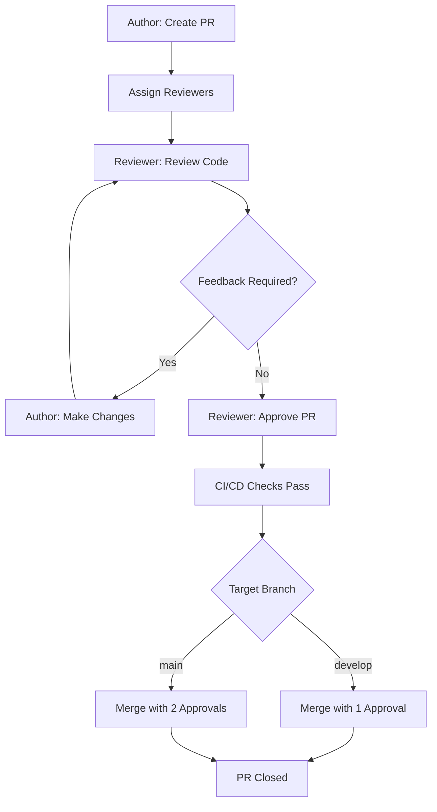

# Code Review Process

Code reviews are essential for maintaining code quality, consistency, and team collaboration. They help identify bugs early, improve readability, and promote shared ownership of the codebase.

## Objectives

- Ensure code is correct, secure, and performant.
- Maintain consistent style and architecture.
- Encourage knowledge sharing across the team.
- Prevent regressions through proper testing.

## Review Workflow

1. **Author submits a pull request (PR)**  
   - Ensure the PR follows [Pull Request Guidelines](https://github.com/RaeKennethFernandez/git-workflows/blob/main/03-pull-request-guidelines.md).
2. **Reviewers are assigned or auto-requested**  
   - Primary reviewers are based on code ownership.
3. **Reviewer evaluates the PR**  
   - Check for:
     - Correctness and logic
     - Test coverage and quality
     - Security vulnerabilities
     - Readability and maintainability
     - Proper documentation
4. **Reviewer provides feedback**  
   - Use comments to request changes or suggest improvements.
   - Keep feedback constructive and respectful.
5. **Author responds and updates code**  
   - Mark resolved conversations as "Resolved".
6. **Approval and Merge**  
   - At least **one approval** for `develop`
   - At least **two approvals** for `main`
   - All required checks (CI/CD) must pass before merging.

## Review SLAs

- Aim to review small PRs within **24 hours**.
- Larger PRs may take **48 hours or more**—break them down if possible.

## Responsibilities

- **Author**:
  - Submit clean, review-ready code.
  - Address feedback promptly.
  - Avoid force-pushing unless necessary.
- **Reviewer**:
  - Provide timely and actionable feedback.
  - Focus on the code, not the coder.
  - Approve when standards are met.

## Conflict Resolution

- If there’s disagreement on a change:
  - Discuss in the PR thread.
  - If unresolved, involve a senior developer or tech lead.

## Workflow Diagram

## Notes
- Number of approvals might vary based on the size of the team or the development guidelines.