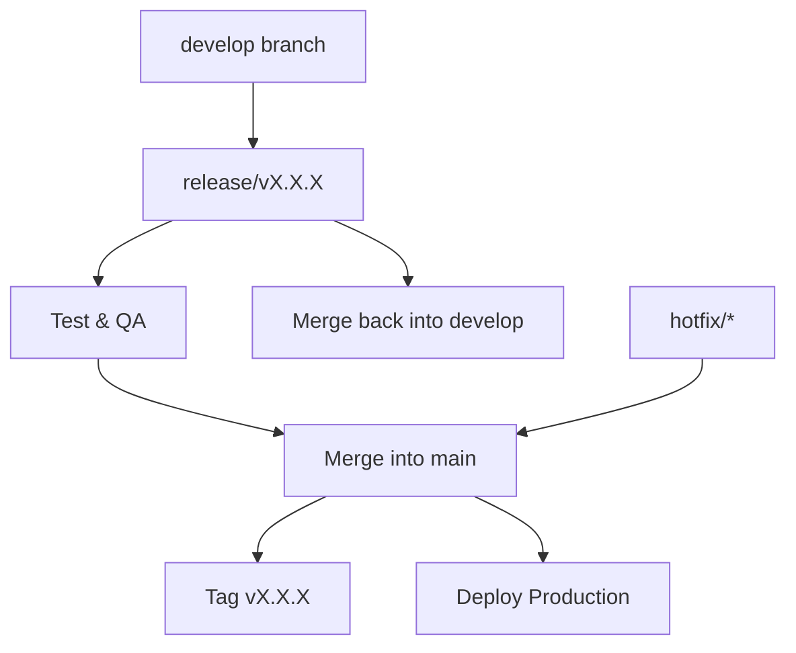

# Release and Tagging Strategy

We follow **Semantic Versioning (SemVer)**:  
`MAJOR.MINOR.PATCH`

- **MAJOR** – Breaking changes (incompatible API changes)
- **MINOR** – New features (backward compatible)
- **PATCH** – Bug fixes and small improvements (backward compatible)

## Release Branch Workflow

1. **Create a release branch from `develop`:**
   ```bash
   git checkout develop
   git checkout -b release/vX.X.X
2. **Finalize the release:**
- Freeze new features (only bug fixes allowed)
- Run final tests and QA
- Update version number in `package.json` / `pyproject.toml` / `composer.json` / etc.

3. **Merge release into main and back into `develop`:**
```bash
git checkout main
git merge --no-ff release/vX.X.X
git checkout develop
git merge --no-ff release/vX.X.X
```
4.**Tag the release:**
```bash
git tag -a vX.X.X -m "Release vX.X.X"
git push origin vX.X.X
```

## Pre-releases and Release Candidates
- Use suffixes like `-beta.1`, `-rc.1` for pre-production versions:
```bash
v2.0.0-beta.1
v2.0.0-rc.1
```

## Hotfix Integration
- Hotfixes from `hotfix/*` are merged directly into `main`, tagged as a PATCH version, then merged back to `develop`.

## CI/CD Integration

- Tagged releases trigger production deployments.
- Pre-release tags trigger staging deployments.

## Workflow
